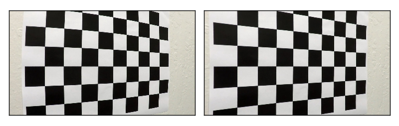
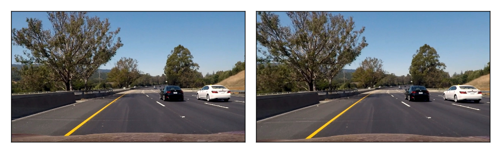
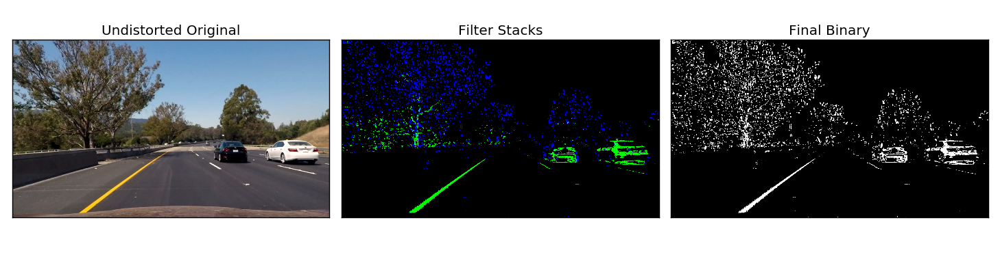
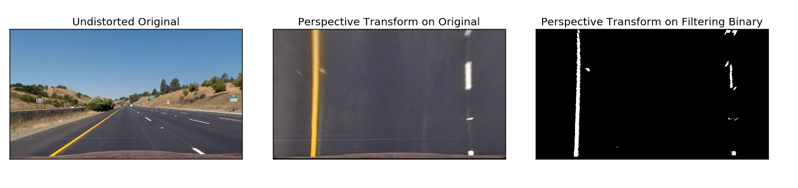
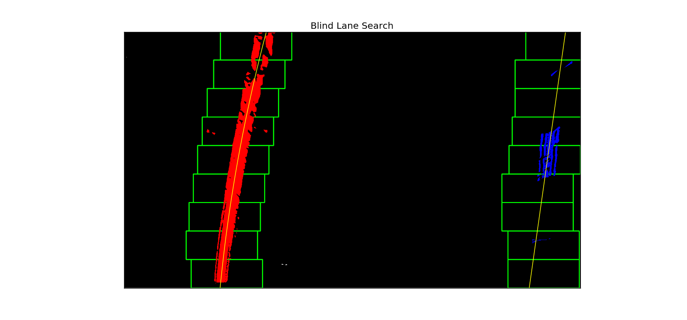
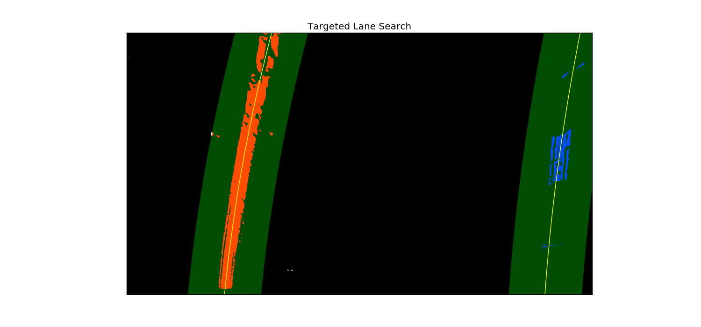
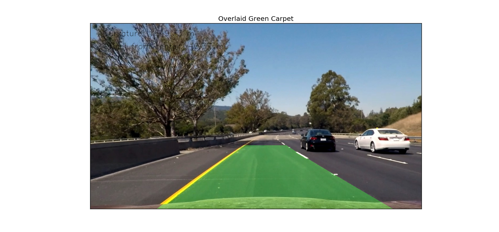

## Advanced Lane Finding Project

# Camera Calibration

The camera matrix and distortion coefficients were calculated using 20 calibration images consisting of images of a chessboard pattern from different perspectives. The OpenCV function `findChessboardCorners` was used to detect the corners in the chessboard images and subsequently used to perform the calibration. Knowing where we expect those corners to be and where they were identified in the distorted image we can then perform the actual camera matrix and distortion coefficients calculation using the OpenCV function `calibrateCamera`.

In `main.py`, this is accomplished by creating an instance of the `Camera` class and then running the `calibrate` method and passing in the calibration images as the argument:

```
camera = Camera(img_size=(1280, 720))
camera.calibrate(cal_images, nx=9, ny=6)
```

# Distortion Correction

The `Camera` class implements a `undistort` image to undistort a raw image:
```
undistorted_img = camera.undistort(distorted_img)
```

We can confirm that the camera has been calibrated correctly by confirming the distorted chessboard images are correctly undistorted and display straight edged chessboard patters:



To confirm that this can be generalized to any image, we can undistort a test image from the on-board front-facing windshield camera and compare its result to and distorted raw image. It's can be seen that lane edges are straighter, especially around the edges of the frame.



# Gradient & Color Thresholding

A mix of gaussian blurring, gradient & color thresholding was used to identify lane pixels. The function `lane_pixels` is used to perform which takes as a single argument an image and returns a binary matrix of the same size of the image with 1's for pixels representing a lane and 0's otherwise.

Prior to performing any gradient thresholding, the sample image is smoothed using a gaussian blur and converted to grayscale. Smoothing is especially useful when it comes to calculating the direction of the sobel derivative directions in the image. For gradient thresholding, two quantities are calculated: magnitude and direction of sobel derivatives. The magnitude represents the scale of the derivative (in both x and y) and the direction provides a measure of what angle a particular 'edge' of pixels is pointing in. By thresholding these two values appropriately, we are then looking for pixels that have a sufficiently large magnitude and are near vertical, as we expect of lane markings.

The sobel derivatives are calculated using the OpenCV function `Sobel` and implemented in `main.py` in the functions `abs_sobel_thresh`, `mag_sobel_thresh` and `dir_sobel_thresh`

Color thresholing consists of converting the image to the HLS color space and isolating the saturation channel. The saturation channel provides a measure of color intensity which is theoretically independent of lightness and color hue. By thresholding this quantity we can look for pixels which have a sufficiently large color intensity such that we identify any markings on the road, regardless of color or light intensity, that are well displayed.

Finally we identify the lane pixels by filtering the originals image by pixels that meet the gradient threshold filter OR the HLS filter:

```
mag_bin = mag_sobel_thresh(gray, kernel=9, thresh=(25, 100))
dir_bin = dir_sobel_thresh(gray, kernel=9, thresh=(np.pi/2*0.8, np.pi/2))
hls_bin = hls_s_thresh(img, thresh=(170, 255))
# Combine the two binary thresholds
binary = np.zeros_like(mag_bin, dtype=np.uint8)
binary[((mag_bin == 1) & (dir_bin == 1)) | (hls_bin == 1)] = 1
```

An example of this operation can be seen in our sample image:


# Perspective Transformation

The perspective transformation is done by first identifying the trapezoidal region of the lane in an example front-facing camera image. The top view perspective transformation corresponds to transforming the original image such that the trapezoidal region is now rectangular. This is capture in two lists of pixel coordinates which describe the trapezoidal and rectangular regions, respectively. This is used to calculate the perspective transformation and inverse transformation to jump from one perspective to other. Also, this assumes that the transformation matrix is valid for all video frames and any dynamics introduced by the vehicle as it drives on the road are negligible.

This is handled by the `Camera` class via the `plan_view` and `front_view` methods which convert to the bird's eye view and driver's view, respectively. The perspective transformation matrices are store in a `Camera` object via the properties `M_plan` and `M_front`. The values are calculated using the `perspective_setup` method.

An example perspective transformation looks like this:


# Lane Identification

Lane identification was performed using the lane pixel binary from the `lane_pixel` function output. The operation is performed by using the `search` method of the `Lane` class. The `Lane` class implements various methods and also contains two instances (left and right) of the `Line` class to implement lane identification, polynomial fitting, geometry calculations and more.

Lane identification is accomplished by one of two searching algorithms: `blind_search` and `targeted_search` implemented as methods of the `Lane` class. The `Lane.search` method decides whether to do a blind or targeted search depending on whether there is prior information describing where we expect lane markings to be in an image. If no such information exists a blind search is conducted which consists of calculating the binary history of the lower half of the image to determine where the two peaks exists. These peaks are a good estimate of where we expect the lanes to start at the bottom of the image. From there we move up in the image using a sliding window approach of a fixed window size until we cover the entire image identifying the pixels relative to the left and right lines independently. Once that process is complete, these two separate sets of pixels are used to fit a polynomial which will describe a smooth curve outlining the lane edge.

As an alternative, a targeted search method is employed when we already have an idea of the where to search for lane. Instead of a sliding window approach, in this case we use a fixed search region consisting of the previous lane edge polynomials fits +/- an horizontal offset. This is done in order to speed up lane finding performance.

For each method the lane pixels identified for the specific image are added to a pool of pixels which represent the lane pixels for the a running tab of 5 consecutive images such that the fitting process is not performed on a single images but instead on 5 consecutive images. This improves robustness and jitter. This is implemented by making use of the `Line.recent_x_pixels` and `Line.recent_y_pixels` which are used for the fitting process.

The fitting process is implemented in the `Line.fit` method. This method decides on whether to to do a second or first order polynomial fit by examining how many pixels were found. The rationale only few pixels were found then we're probably dealing with a single dashed lane marking and we can't robustly fit a second order polynomial to such a concentrated set of pixels. To avoid large overfitting errors, we make the design decision to fit a straight line instead to instance where relatively few pixels were found. To improve this method further it would be interesting to make the polynomial order decision based on a histogram along the vertical axis of the image to provide a more robust measure of weather or not we have sufficiently broadly spaced pixels to fit a high order polynomial to the pixels.

An example of the lane fitting is provided for each search method:





# Lane Geometry

The radius of curvature is a crucial measure for lateral dynamics of vehicle control. The calculation of this is done using the lane edge polynomial fits. By assuming that at any point in time, the vehicle is travelling tangential to an imaginary circle we can find the center of that circle (the radius or curvature) using our polynomial and applying some calculus and taking the appropriate derivates. In order to move from the pixel space to the meters we use a constant pixel-to-meter gain that has been assumed to be 3.7 m per pixel for the x-lateral dimension. The radius of curvature is calculated at the lowest edge of the image.

The lateral offset from the lane center is also calculated using the lowest edge of the image. In this case we assume that the vehicle center is at the exact center of the image and we simply calculate the lateral offset of the center of the image to the midpoint between the left and right lane edges to arrive at this number. A negative value in this case means the vehicle is to the left of the lane center. Like the radius of curvature, the measure is calculate in meters and relies on the same pixel-to-meter gain.

# Lane Overlay

Having fit lane edge polynomials, calculated the radius of curvature and distance from lane center using the bird's eye view, this information can be overlaid back on the original undistorted image by using the inverse perspective transformation matrix. The lane edges are displayed using a 'green carpet' and the radius of curvature and lane center offset as overlaid text:



# Example Output

The performance of the code can be visually evaluated using the example project_video.mp4 file.

[](https://www.youtube.com/watch?v=05e3YNzs7xE)

# Discussion

Issues identified in the pipeline include the following
* Color space thresholding: a better job can probably be done in more robustly identify the expected color hues of interest. At the moment any color will trigger a lane-line pixel if it has enough color intensity but in reality we can make use of the fact that lane marking follow strict regulations defining their color.
* At the moment, my code makes no use of the length of the lane when detecting lane-line pixels. It would be useful to make use of hough line algorithms to ensure that a lane-line pixels need to be part of a contiguous line of some minimum distance that's appropriate of a lane marker.
* Lane fitting: fitting a polynomial to cases where only a single lane edge dash is present in the image is problematic. In these cases it's all too easy for the code to get tripped up a fit a high order polynomial that bends wildly while still fitting the small single dashed marker well. I've tried to remedy this by identifying single dashes and fitting a line instead of a 2nd order polynomial but a more robust method should be explored.
* At the moment I make no use of sanity checks to ensure that the left and right lane are roughly parallel. A better option would be to identify these cases and ignore them and instead use prior information to fill in single lane identification anomalies.
